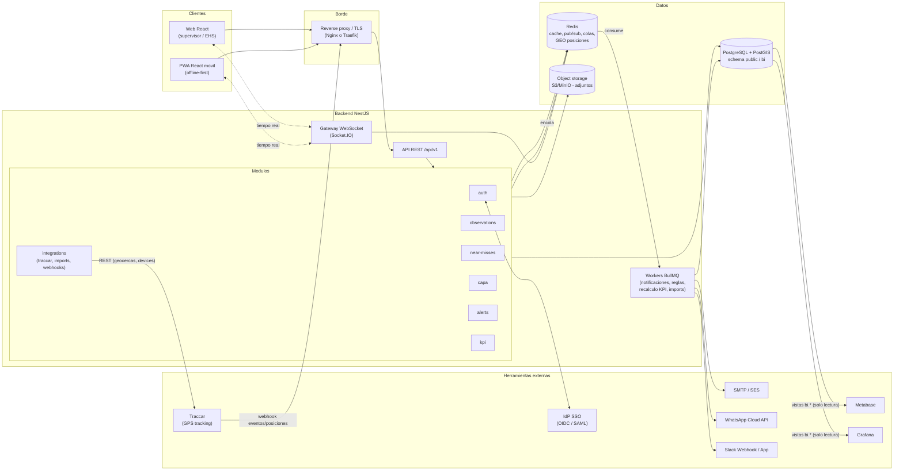
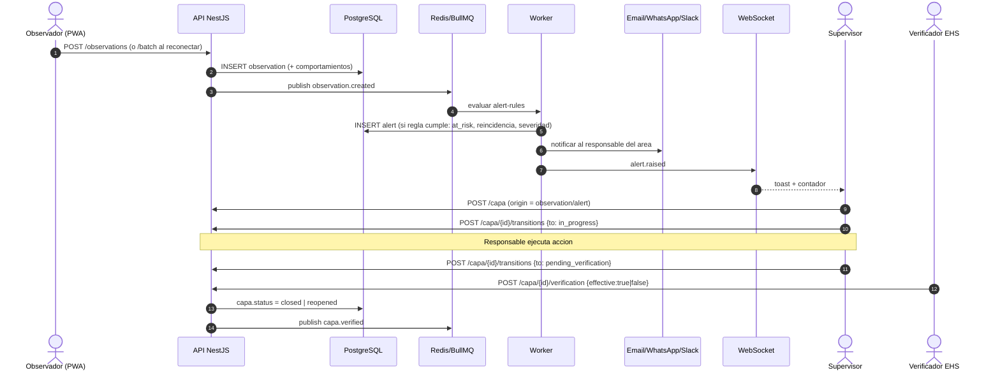
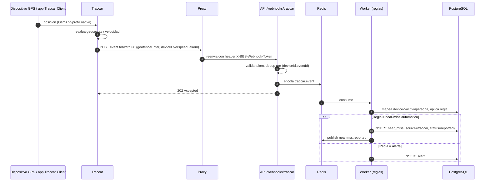
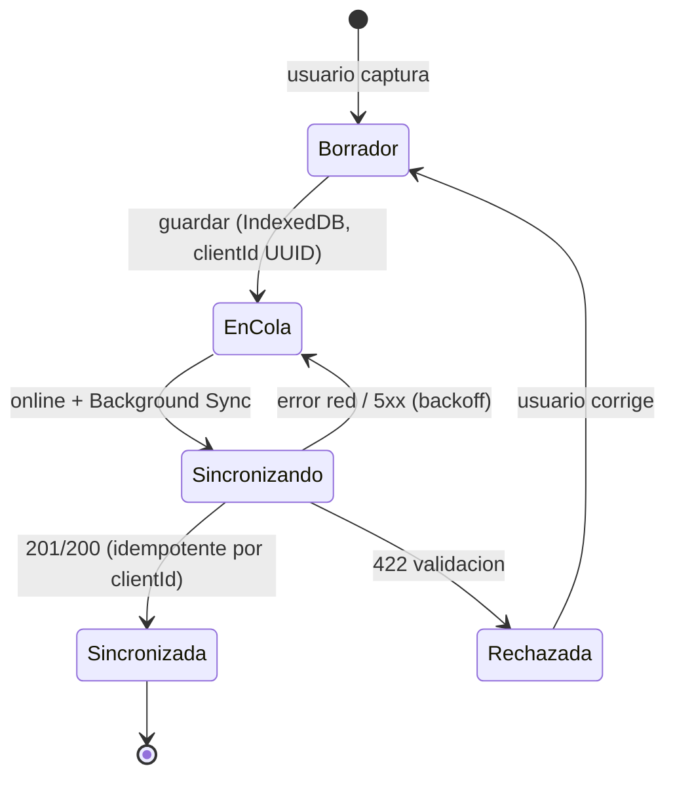

# BBS (Behavior-Based Safety) - Arquitectura

Alcance: plataforma EHS para observaciones de comportamiento, near-miss, CAPA, alertas y KPIs, con tracking GPS opcional via Traccar.
Ciclo central: **Observacion -> Alerta -> CAPA -> Verificacion**.

## 1. Principios

1. **Offline-first en movil**: el observador registra en planta sin cobertura; sincroniza despues (cola local + `POST /observations/batch` idempotente).
2. **Un solo modelo de eventos**: toda fuente (movil, Traccar, importacion Excel) termina como una entidad de dominio + un evento interno en Redis (`bbs.events`).
3. **API primero**: `openapi.yaml` es el contrato; frontend, integraciones y BI lo consumen. El frontend genera su cliente tipado desde el.
4. **Integraciones desacopladas**: webhooks entrantes validados y encolados (BullMQ); notificaciones salientes por adaptadores (email/WhatsApp/Slack/webhook).
5. **BI sin tocar tablas operativas**: vistas `bi.*` de solo lectura sobre PostgreSQL con rol `bbs_readonly`.

## 2. Diagrama de componentes

## 3. Componentes

| Componente | Tecnologia | Responsabilidad |
|---|---|---|
| Frontend movil | React + Vite + PWA (Workbox), Dexie (IndexedDB) | Captura rapida offline, cola de sync, fotos, GPS del dispositivo |
| Frontend web | React + TanStack Query + Router, MUI o shadcn/ui | CAPA board, near-miss, dashboards, administracion |
| API | NestJS (REST, OpenAPI via `@nestjs/swagger`), class-validator | Casos de uso, RBAC, validacion, idempotencia |
| WebSockets | `@nestjs/websockets` + Socket.IO + adapter Redis | Push de alertas, cambios de estado CAPA, contadores del dashboard |
| PostgreSQL | 16 + PostGIS | Fuente de verdad. Geometrias de geocercas/ubicaciones. Esquema `bi` para BI |
| Redis | 7 | Colas BullMQ, pub/sub, rate-limit, cache de KPIs, `GEOADD` de ultima posicion por dispositivo |
| Traccar | traccar/traccar | Ingesta GPS (200+ protocolos), geocercas, eventos; reenvia a BBS por webhook |
| Notificaciones | Adaptadores Nest (email, WhatsApp, Slack, webhook generico) | Envio con plantillas, reintentos, registro de entrega |
| BI | Metabase (negocio) y Grafana (operativo/mapas) | Lectura de vistas `bi.*` |
| Adjuntos | S3 compatible (MinIO en dev) | Fotos/evidencia con URL prefirmada |
| Observabilidad | OpenTelemetry, Prometheus, logs JSON | Trazas por `correlationId` |

## 4. Modulos backend y su contrato

| Modulo | Recursos OpenAPI | Eventos de dominio (Redis `bbs.events`) |
|---|---|---|
| auth | `/auth/*` | `user.logged_in` |
| observations | `/observations`, `/observations/batch`, `/catalog/*` | `observation.created`, `observation.at_risk_flagged` |
| near-misses | `/near-misses`, `/near-misses/map` | `nearmiss.reported`, `nearmiss.status_changed` |
| capa | `/capa`, `/capa/board`, `/capa/{id}/transitions`, `/capa/{id}/verification` | `capa.created`, `capa.status_changed`, `capa.overdue`, `capa.verified` |
| alerts | `/alerts`, `/alert-rules` | `alert.raised`, `alert.acknowledged` |
| kpi | `/kpis/*` | `kpi.snapshot_updated` |
| integrations | `/webhooks/*`, `/webhook-subscriptions`, `/imports/*`, `/geofences` | `integration.event_received` |

## 5. Flujos clave

### 5.1 Observacion -> Alerta -> CAPA -> Verificacion

### 5.2 Traccar -> near-miss / alerta

### 5.3 Sincronizacion offline

## 6. Decisiones de diseno

- **Idempotencia**: observaciones/near-misses aceptan `clientId` (UUIDv4 generado en el dispositivo); unico por tenant. Webhooks externos deduplican por clave natural (`traccar:{eventId}`).
- **Multi-sitio**: toda entidad lleva `siteId`; RBAC por rol (`observer`, `supervisor`, `ehs_manager`, `verifier`, `admin`) y alcance por sitio/area.
- **Tiempo real**: namespace `/realtime`, salas `site:{id}` y `user:{id}`. Eventos: `alert.raised`, `capa.status_changed`, `nearmiss.reported`, `kpi.updated`. Token JWT en handshake.
- **Geodatos**: PostGIS `geography(Point,4326)` para ubicaciones, `geography(Polygon)` para geocercas; la fuente de las geocercas es BBS y se sincroniza a Traccar (o viceversa, configurable) via `/geofences`.
- **Privacidad**: el tracking de personas requiere base legal/consentimiento; por defecto Traccar solo rastrea **vehiculos y equipos**; los tags de personas son opt-in. Retencion de posiciones 30-90 dias.
- **Seguridad**: JWT corto (15 min) + refresh rotatorio, SSO OIDC, HMAC/token en webhooks, rate-limit en Redis, adjuntos con URL prefirmada y antivirus opcional.
- **Escalado**: API stateless; WS con adapter Redis; workers escalan por cola.
- **BI**: Metabase para autoservicio de gerencia; Grafana para mapa de calor y series casi en tiempo real. Ambos con rol `bbs_readonly` sobre esquema `bi`.

## 7. Entornos

| Entorno | Notas |
|---|---|
| dev/integracion | `integration/docker-compose.yml` (Traccar, Metabase, Grafana, Mailhog, Postgres, Redis) |
| prod | Contenedores orquestados (K8s/ECS), Postgres gestionado, Redis gestionado, S3, TLS, secretos en vault |

## 8. Documentos relacionados

- `UX.md`: flujos y wireframes, estructura React.
- `INTEGRACIONES.md`: conexion y payloads de cada herramienta.
- `openapi.yaml`: contrato de la API.
- `integration/`: entorno de referencia.
