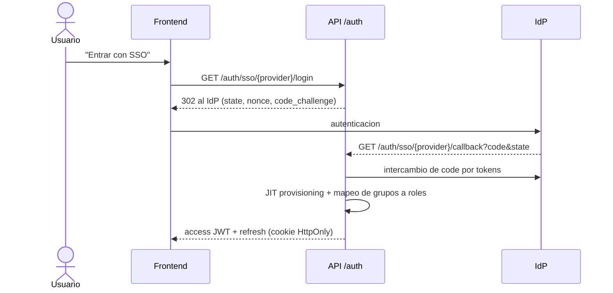

# BBS - Guia de integraciones

Convenciones comunes:

- Base URL API: `https://bbs.example.com/api/v1` (dev: `http://localhost:3000/api/v1`).
- Entrantes (webhooks): `POST /webhooks/{source}`, responden **202** rapido, encolan en BullMQ y procesan en worker. Autenticacion por header `X-BBS-Webhook-Token` (o firma HMAC SHA-256 en `X-BBS-Signature: sha256=<hex>` cuando la fuente la soporta). Deduplicacion por clave natural.
- Salientes: adaptadores de notificacion (email, WhatsApp, Slack, webhook generico) alimentados por el evento `alert.raised` y reglas de `alert-rules`. Cada envio se registra (`notification_log`) con reintentos exponenciales (1m, 5m, 30m; max 5).
- Todos los payloads usan UTC ISO-8601. Secretos solo por variables de entorno.

Resumen:

| Herramienta | Direccion | Metodo | Eventos principales |
|---|---|---|---|
| Traccar | entrante + REST saliente | Webhook (`event.forward.url`) + REST Traccar | `geofenceEnter/Exit`, `deviceOverspeed`, `alarm`, `deviceOffline` |
| Email | saliente | SMTP (Mailhog en dev) | `alert.raised`, `capa.assigned`, `capa.overdue`, resumen semanal |
| WhatsApp | saliente (+ estado entrante) | WhatsApp Cloud API (plantillas) | `alert.raised` critica, `capa.overdue` |
| Slack | saliente | Incoming Webhook / chat.postMessage | `alert.raised`, `nearmiss.reported`, `capa.verified` |
| SSO | entrante | OIDC (Authorization Code + PKCE) / SAML via IdP | login |
| BI | lectura | Vistas `bi.*` + rol `bbs_readonly` (Metabase/Grafana) | n/a |
| Excel | entrante | `POST /imports/excel` (CSV/XLSX) | `import.completed` |
| Webhooks salientes genericos | saliente | `/webhook-subscriptions` | todos los eventos de dominio |

---

## 1. Traccar (GPS) -> geocercas / near-miss

### 1.1 Metodo de conexion

Dos canales:

1. **Traccar -> BBS (push)**: Traccar reenvia eventos con `event.forward.*` (y opcionalmente posiciones con `forward.*`) a `POST /webhooks/traccar`. Configuracion en `traccar.xml` (ver `integration/traccar/traccar.xml`):

   ```xml
   <entry key='event.forward.enable'>true</entry>
   <entry key='event.forward.url'>http://api:3000/api/v1/webhooks/traccar</entry>
   <entry key='event.forward.json'>true</entry>
   <entry key='event.forward.header'>X-BBS-Webhook-Token: ${BBS_WEBHOOK_TOKEN}</entry>
   <entry key='event.types'>geofenceEnter,geofenceExit,deviceOverspeed,alarm,deviceOffline</entry>
   ```

   (Traccar no interpola variables de entorno en el XML; en el compose se usa `CONFIG_USE_ENVIRONMENT_VARIABLES=true` con variables `EVENT_FORWARD_URL`, `EVENT_FORWARD_HEADER`, etc. Verifica los nombres de claves en la version de Traccar que uses.)

2. **BBS -> Traccar (pull/REST)**: servicio `integrations/traccar` usa la API REST de Traccar (`/api/devices`, `/api/geofences`, `/api/positions`, `/api/permissions`) con token de API (usuario de servicio) para: sincronizar dispositivos, crear/actualizar geocercas desde BBS (`GET/POST /geofences`), consultar la ultima posicion y reconciliar eventos perdidos (job cada 5 min por `GET /api/events` o `/api/reports/events`).

### 1.2 Mapeo y reglas

Tabla `integration_device_map`: `traccarDeviceId` -> `assetId` / `userId` (persona solo con consentimiento) / `siteId`.
Tabla `geofence_rule`: `traccarGeofenceId`, `kind` (`restricted_zone`, `pedestrian_zone`, `speed_zone`, `loading_area`), `action`.

| Evento Traccar | Condicion | Resultado en BBS |
|---|---|---|
| `geofenceEnter` | geocerca `restricted_zone`, activo sin autorizacion | `alert` severidad `high` |
| `geofenceEnter` | `pedestrian_zone` + vehiculo motorizado | `near_miss` automatico (`source=traccar`, `status=reported`) |
| `deviceOverspeed` | `speed > limite de zona` | `alert` `medium`; 3 en 24h -> `near_miss` |
| `alarm` (`sos`, `hardBraking`, `accident`, `fallDetect`) | siempre | `alert` `critical` / `near_miss` (hardBraking) |
| `deviceOffline` | > 15 min en turno | `alert` `low` |
| Proximidad vehiculo-persona | distancia < 5 m (calculado por worker con `GEORADIUS`/PostGIS sobre posiciones) | `near_miss` automatico `high` |

Idempotencia: clave `traccar:{event.id}`; si falta id, `traccar:{deviceId}:{type}:{eventTime}`.

### 1.3 Payload entrante (evento) - `POST /webhooks/traccar`

El formato real depende de la version; BBS acepta el JSON de Traccar con `event`, `position`, `device`, `geofence` (envoltorio) o el objeto `event` plano.

```json
{
  "event": {
    "id": 98213,
    "type": "geofenceEnter",
    "eventTime": "2026-10-06T14:12:07.000+00:00",
    "deviceId": 17,
    "positionId": 5521307,
    "geofenceId": 4,
    "attributes": {}
  },
  "device": {
    "id": 17,
    "name": "Montacargas MC-03",
    "uniqueId": "865432109876543",
    "category": "truck",
    "attributes": { "siteId": "PLANTA-2" }
  },
  "position": {
    "id": 5521307,
    "deviceId": 17,
    "fixTime": "2026-10-06T14:12:05.000+00:00",
    "latitude": -33.44891,
    "longitude": -70.66927,
    "speed": 9.7,
    "course": 184,
    "accuracy": 4,
    "attributes": { "batteryLevel": 88, "ignition": true }
  },
  "geofence": {
    "id": 4,
    "name": "Zona peatonal - Pasillo B",
    "description": "pedestrian_zone"
  }
}
```

Nota: `speed` en Traccar esta en **nudos**; BBS convierte a km/h (x1.852).

Respuesta: `202 {"accepted": true, "deduplicated": false}`.

### 1.4 Eventos que BBS produce a partir de Traccar

```json
{
  "id": "evt_01JAB3...",
  "type": "nearmiss.reported",
  "occurredAt": "2026-10-06T14:12:07Z",
  "siteId": "PLANTA-2",
  "data": {
    "nearMissId": "6f1c1b0e-6b2a-4d2e-9a62-6d7b6f0c8a11",
    "source": "traccar",
    "severity": "high",
    "title": "Montacargas MC-03 ingreso a zona peatonal Pasillo B",
    "location": { "lat": -33.44891, "lng": -70.66927 },
    "externalRef": "traccar:98213"
  }
}
```

### 1.5 Payload de sincronizacion de geocerca (BBS -> Traccar REST)

`POST {TRACCAR}/api/geofences` (Basic/Bearer del usuario de servicio):

```json
{
  "name": "Zona peatonal - Pasillo B",
  "description": "pedestrian_zone",
  "area": "POLYGON((-33.4488 -70.6695, -33.4488 -70.6690, -33.4491 -70.6690, -33.4491 -70.6695, -33.4488 -70.6695))",
  "attributes": { "bbsGeofenceId": "b7c2..." }
}
```

(WKT: Traccar usa orden `lat lon`.) Luego `POST /api/permissions` `{ "deviceId": 17, "geofenceId": 4 }`.

### 1.6 Seguridad y operacion

Token compartido en header, allowlist IP de Traccar en el proxy, limite 100 req/s, tamano max 64 KB, cola con DLQ. Monitoreo: metrica `integration_traccar_lag_seconds`.

---

## 2. Email (SMTP)

**Conexion**: Nodemailer/`@nestjs-modules/mailer` -> SMTP (`SMTP_HOST`, `SMTP_PORT`, `SMTP_USER`, `SMTP_PASS`, `SMTP_FROM`). Dev: Mailhog (`mailhog:1025`, UI `http://localhost:8025`). Prod: SES/SendGrid SMTP.

**Eventos**: `alert.raised` (por severidad), `capa.assigned`, `capa.due_soon` (3 d), `capa.overdue`, `capa.verification_requested`, `digest.weekly`.

Plantilla (`alert.raised`) - mensaje compuesto por el worker:

```json
{
  "channel": "email",
  "to": ["jefe.area@example.com"],
  "subject": "[ALTA] Montacargas en zona peatonal - Planta 2",
  "template": "alert-raised",
  "locale": "es",
  "context": {
    "alertId": "0c9e4a5e-3c52-4f0a-8b1a-6e07f9e1a001",
    "severity": "high",
    "title": "Montacargas MC-03 ingreso a zona peatonal Pasillo B",
    "site": "Planta 2",
    "occurredAt": "2026-10-06T14:12:07Z",
    "url": "https://bbs.example.com/alerts/0c9e4a5e-3c52-4f0a-8b1a-6e07f9e1a001"
  }
}
```

Incluir enlace de acuse (`/alerts/{id}` -> `POST /alerts/{id}/acknowledge`). Bounces/complaints llegan por webhook del proveedor a `POST /webhooks/email-provider` (opcional).

---

## 3. WhatsApp (Cloud API de Meta)

**Conexion**: `POST https://graph.facebook.com/v20.0/{PHONE_NUMBER_ID}/messages` con `Authorization: Bearer {WHATSAPP_TOKEN}`. Fuera de la ventana de 24 h solo se permiten **plantillas aprobadas** (categoria `utility`). Alternativa: Twilio WhatsApp. Opt-in obligatorio del usuario (campo `notificationPrefs.whatsapp` en perfil).

**Eventos**: solo criticos para evitar fatiga: `alert.raised` (`critical`/`high`), `capa.overdue`.

Payload saliente:

```json
{
  "messaging_product": "whatsapp",
  "to": "56912345678",
  "type": "template",
  "template": {
    "name": "bbs_alerta_critica",
    "language": { "code": "es" },
    "components": [
      {
        "type": "body",
        "parameters": [
          { "type": "text", "text": "ALTA" },
          { "type": "text", "text": "Montacargas en zona peatonal - Planta 2" },
          { "type": "text", "text": "14:12" }
        ]
      },
      {
        "type": "button", "sub_type": "url", "index": "0",
        "parameters": [ { "type": "text", "text": "0c9e4a5e-3c52-4f0a-8b1a-6e07f9e1a001" } ]
      }
    ]
  }
}
```

Webhook entrante de estado (verificacion `GET hub.challenge` + firma `X-Hub-Signature-256`) en `POST /webhooks/whatsapp`:

```json
{
  "object": "whatsapp_business_account",
  "entry": [{
    "changes": [{
      "field": "messages",
      "value": {
        "statuses": [{ "id": "wamid.HBg...", "status": "delivered", "timestamp": "1759760000", "recipient_id": "56912345678" }]
      }
    }]
  }]
}
```

Respuestas de botones (ej. "Enterado") se mapean a `POST /alerts/{id}/acknowledge`.

---

## 4. Slack

**Conexion**: lo mas simple, **Incoming Webhook** por canal (`SLACK_WEBHOOK_URL_<SITE>`); para botones interactivos, Slack App con `chat.postMessage` + endpoint `POST /webhooks/slack` (Interactivity, verificacion `X-Slack-Signature`).

**Eventos**: `alert.raised`, `nearmiss.reported`, `capa.verified`, `capa.overdue`.

Payload (Block Kit):

```json
{
  "channel": "#ehs-planta2",
  "text": "[ALTA] Montacargas en zona peatonal - Planta 2",
  "blocks": [
    { "type": "header", "text": { "type": "plain_text", "text": "Alerta ALTA - Planta 2" } },
    { "type": "section", "fields": [
      { "type": "mrkdwn", "text": "*Tipo:*\nNear-miss (Traccar)" },
      { "type": "mrkdwn", "text": "*Hora:*\n14:12" }
    ]},
    { "type": "actions", "elements": [
      { "type": "button", "text": { "type": "plain_text", "text": "Ver en BBS" },
        "url": "https://bbs.example.com/alerts/0c9e4a5e-3c52-4f0a-8b1a-6e07f9e1a001" },
      { "type": "button", "text": { "type": "plain_text", "text": "Enterado" },
        "action_id": "ack_alert", "value": "0c9e4a5e-3c52-4f0a-8b1a-6e07f9e1a001" }
    ]}
  ]
}
```

Payload entrante de interactividad (resumido): `{"type":"block_actions","user":{"id":"U123"},"actions":[{"action_id":"ack_alert","value":"<alertId>"}]}` -> el backend resuelve `slackUserId -> userId` y ejecuta el acuse.

---

## 5. SSO (OIDC / SAML)

**Conexion**: OIDC Authorization Code + PKCE contra Azure AD / Okta / Google Workspace / Keycloak. Modulo `auth`: Passport `openid-client`. SAML 2.0 via `passport-saml` si el IdP lo exige.

Flujo:



Mapeo de claims -> usuario/rol (configurable por tenant):

```json
{
  "provider": "azuread",
  "issuer": "https://login.microsoftonline.com/<tenant>/v2.0",
  "clientId": "<id>",
  "scopes": ["openid", "profile", "email"],
  "claimMapping": { "email": "email", "name": "name", "groups": "groups" },
  "roleMapping": {
    "BBS-Observers": "observer",
    "BBS-Supervisors": "supervisor",
    "BBS-EHS": "ehs_manager",
    "BBS-Verifiers": "verifier",
    "BBS-Admins": "admin"
  },
  "siteMapping": { "claim": "officeLocation", "default": "PLANTA-1" }
}
```

Opcional SCIM 2.0 para altas/bajas automaticas (fuera del MVP).

---

## 6. BI: Metabase y Grafana

**Conexion**: conexion directa de lectura a PostgreSQL con rol `bbs_readonly`, solo esquema `bi`. No se expone el esquema operativo.

```sql
CREATE ROLE bbs_readonly LOGIN PASSWORD '***';
GRANT USAGE ON SCHEMA bi TO bbs_readonly;
GRANT SELECT ON ALL TABLES IN SCHEMA bi TO bbs_readonly;
ALTER DEFAULT PRIVILEGES IN SCHEMA bi GRANT SELECT ON TABLES TO bbs_readonly;
```

Vistas propuestas (alineadas con modulos y KPIs):

| Vista | Contenido |
|---|---|
| `bi.v_observations` | fecha, sitio, area, turno, observador, n_seguros, n_riesgo, categoria top |
| `bi.v_observation_behaviors` | una fila por comportamiento observado (categoria, resultado) |
| `bi.v_near_misses` | fecha, fuente, severidad, estado, lat/lng, area |
| `bi.v_capa` | codigo, origen, prioridad, estado, dias_abierta, vencida, efectiva |
| `bi.v_alerts` | severidad, canal, tiempo_acuse, tiempo_cierre |
| `bi.v_kpi_daily` | `(day, site_id, kpi_code, value)` materializada, refresco cada 15 min |

Metabase: `Admin > Databases > PostgreSQL`, host `db`, DB `bbs`, usuario `bbs_readonly`; colecciones por rol; embedding firmado (JWT) para incrustar dashboards en la web (`METABASE_EMBEDDING_SECRET`):

```json
{ "resource": { "dashboard": 3 }, "params": { "site_id": "PLANTA-2" }, "exp": 1759764000 }
```

Grafana: datasource PostgreSQL (provisioning en `integration/grafana/provisioning/datasources/bbs.yml`), paneles de series temporales y **Geomap** con `bi.v_near_misses`. Alertas de Grafana pueden enviar a `POST /webhooks/grafana` (opcional) para correlacionar.

Alternativa de empuje: endpoints `GET /kpis/*` (JSON) para herramientas que prefieran API (JSON datasource de Grafana).

---

## 7. Importacion desde Excel (opcional)

**Conexion**: `POST /imports/excel` (multipart: `file`, `entity` = `observations|near_misses|capa`, `mappingId` o `mapping` JSON, `dryRun`). Procesa en worker; el progreso se consulta con `GET /imports/{id}` o por WS `import.progress`.

Pasos: (1) subir con `dryRun=true` -> reporte de validacion fila a fila; (2) corregir; (3) reenviar con `dryRun=false`. Idempotencia por `externalRef` (hash de fila o columna ID).

Mapeo de ejemplo:

```json
{
  "entity": "observations",
  "sheet": "Observaciones",
  "headerRow": 1,
  "dateFormat": "DD/MM/YYYY",
  "columns": {
    "Fecha": "observedAt",
    "Area": { "field": "areaCode", "lookup": "areas.name" },
    "Observador": { "field": "observerEmail" },
    "Turno": { "field": "shift", "map": { "M": "morning", "T": "afternoon", "N": "night" } },
    "Comportamiento": { "field": "behaviorCode", "lookup": "behaviors.name" },
    "Resultado": { "field": "result", "map": { "Seguro": "safe", "Riesgo": "at_risk" } },
    "Comentario": "notes"
  },
  "externalRefColumn": "ID"
}
```

Reporte de resultado:

```json
{
  "importId": "imp_01JAB...",
  "status": "completed",
  "totals": { "rows": 420, "created": 401, "duplicates": 12, "rejected": 7 },
  "errors": [
    { "row": 18, "column": "Area", "code": "LOOKUP_NOT_FOUND", "message": "Area 'Bodga' no existe" }
  ]
}
```

---

## 8. Webhooks salientes genericos

Para ERP, ticketing (Jira/ServiceNow), Power Automate/Zapier: suscripcion via `POST /webhook-subscriptions` (`url`, `events[]`, `secret`). Entrega con firma `X-BBS-Signature: sha256=<hmac(body, secret)>`, `X-BBS-Event`, `X-BBS-Delivery`. Reintentos y registro de entregas (`GET /webhook-subscriptions/{id}/deliveries`).

Sobre (envelope) comun:

```json
{
  "id": "evt_01JAB3X9Q7",
  "type": "capa.status_changed",
  "occurredAt": "2026-10-06T15:30:00Z",
  "siteId": "PLANTA-2",
  "data": {
    "capaId": "9a1d3f6e-2b6f-4b49-9b9e-1c5d2d2a7e10",
    "code": "CAPA-112",
    "from": "open",
    "to": "in_progress",
    "actor": { "id": "u_17", "name": "J. Ruiz" }
  }
}
```

## 9. Catalogo de eventos de dominio

`observation.created`, `observation.at_risk_flagged`, `nearmiss.reported`, `nearmiss.status_changed`, `alert.raised`, `alert.acknowledged`, `capa.created`, `capa.assigned`, `capa.status_changed`, `capa.overdue`, `capa.verified`, `import.completed`, `kpi.snapshot_updated`.
