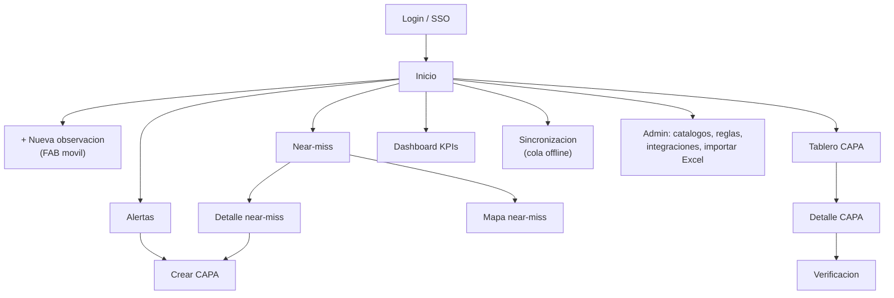
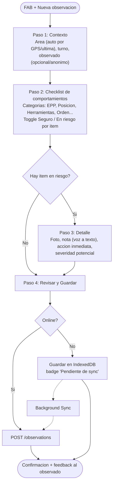
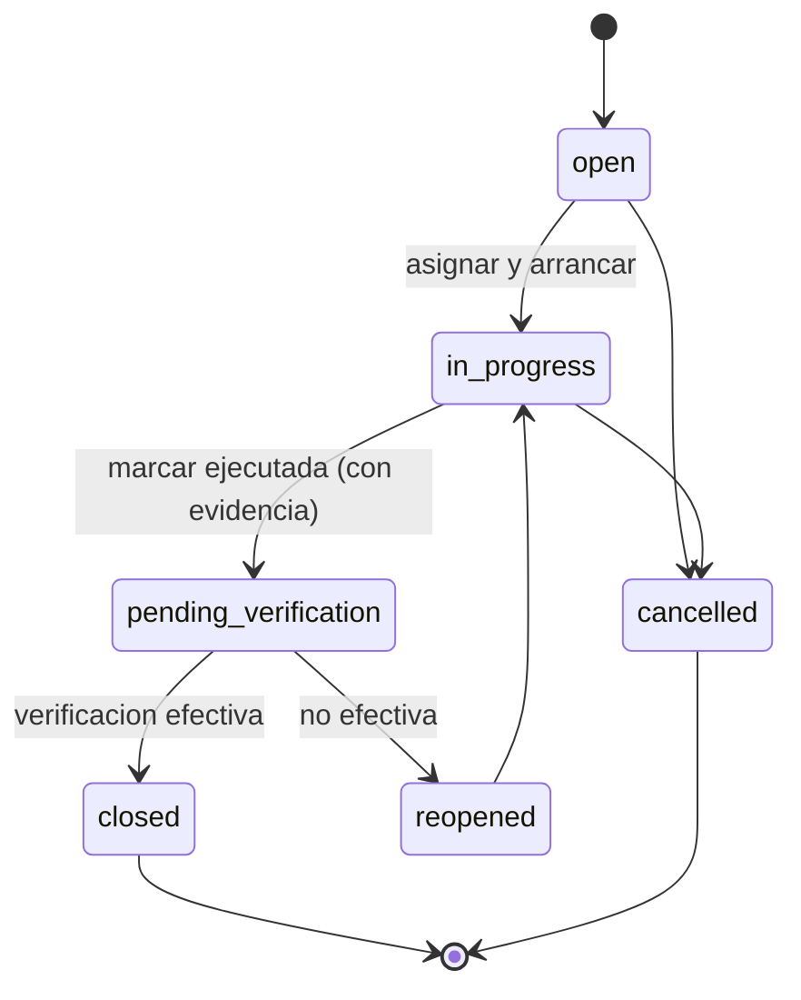
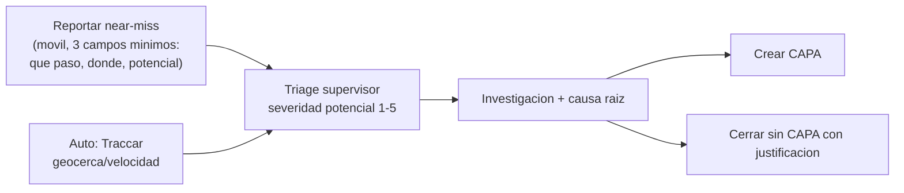

# BBS - Diseno UX/UI y frontend

Roles: **Observador** (movil, campo), **Supervisor** (movil + web), **Gerente EHS / Verificador** (web), **Admin**.

## 1. Mapa de navegacion



## 2. Flujo: registro de observacion en movil (rapido, offline-first)

Objetivo: **< 30 s y <= 4 toques** para el caso comun (comportamiento seguro/riesgoso con checklist).



### Wireframe (390 px)

```text
+------------------------------------+
| <  Nueva observacion     [offline] |  <- indicador de conectividad
|  Paso 2 de 3  [=====-----]         |
+------------------------------------+
| Area: Planta 2 - Linea 3   [GPS ok]|
| Turno: Manana v    Anonimo [ ]     |
+------------------------------------+
| EPP                                |
|  Casco                 [Seguro|RIESGO]
|  Guantes               [Seguro|RIESGO]
|  Proteccion auditiva   [Seguro|RIESGO]
| Posicion / Ergonomia          >    |
| Herramientas                  >    |
| Orden y limpieza              >    |
+------------------------------------+
| Resumen: 7 seguros  1 en riesgo    |
|                                    |
| [  Camara  ]  [  Nota por voz  ]   |
+------------------------------------+
| [ Atras ]            [ Siguiente ] |
+------------------------------------+
```

Pantalla de confirmacion:

```text
+------------------------------------+
|        (check)  Guardada           |
|  Pendiente de sincronizar (1)      |
|  Gracias. Comparte el feedback:    |
|  "Reconoce lo seguro, corrige      |
|   lo riesgoso, en el momento."     |
|  [ Nueva observacion ] [ Inicio ]  |
+------------------------------------+
```

Reglas UX: defaults inteligentes (ultimo area/turno), items "Seguro" preseleccionados, plantillas por area, haptics, minimo 44 px de objetivo tactil, alto contraste, funciona con guantes (botones grandes), texto de ayuda en el idioma del usuario.

## 3. Flujo: tablero de seguimiento de CAPAs



Estados de API: `open`, `in_progress`, `pending_verification`, `closed`, `reopened`, `cancelled`. `overdue` es un flag derivado (`dueDate < hoy` y no cerrada).

### Wireframe (web, kanban)

```text
+--------------------------------------------------------------------------------+
| CAPA   [Sitio v] [Responsable v] [Prioridad v] [Origen v] [x] Vencidas  [+ CAPA]|
+--------------------------------------------------------------------------------+
| ABIERTAS (8)    | EN CURSO (5)    | PEND. VERIF. (3) | CERRADAS (41)   |
|-----------------|-----------------|------------------|-----------------|
| [CAPA-112] ALTA | [CAPA-104] MEDIA| [CAPA-098] ALTA  | [CAPA-077]      |
| Guarda faltante | Senalizacion    | Anclaje linea    | Orden zona B    |
| Origen: NM-31   | Resp: J. Ruiz   | Resp: A. Soto    | Verif. 12/09    |
| Vence 12/10     | Vence 15/10     | Evid.: 2 fotos   |                 |
| (!) 2 dias      | [=====---] 60%  | [Verificar]      |                 |
+--------------------------------------------------------------------------------+
| Vista: [Kanban] [Lista] [Calendario]            Arrastrar = transicion (valida) |
+--------------------------------------------------------------------------------+
```

Detalle CAPA (panel lateral): cabecera (codigo, prioridad, estado), origen enlazado (observacion/near-miss/alerta), causa raiz (5 porques/campo libre), acciones (checklist con responsable y fecha), evidencias, comentarios, linea de tiempo de auditoria, boton **Verificar** (solo rol verificador, distinto del ejecutor).

## 4. Vista de near-miss



### Wireframe (web: lista + mapa)

```text
+--------------------------------------------------------------------------------+
| Near-miss  [Rango: 30d v] [Sitio v] [Estado v] [Fuente: Todas v]  [Lista|Mapa] |
+-----------------------------------------+--------------------------------------+
| #NM-031  ALTA  Auto (Traccar)  Nuevo    |         [ MAPA ]                     |
| Montacargas en zona peatonal   hoy 09:12|    (o)  clusters por severidad       |
| #NM-030  MEDIA  Manual  En investig.    |        (o)   zona de calor           |
| Casi caida de herramienta     ayer      |   (poligonos de geocercas)           |
| #NM-029  BAJA   Manual  Cerrado         |                                      |
+-----------------------------------------+--------------------------------------+
| Detalle: descripcion | fotos | ubicacion | linea de tiempo | [Crear CAPA]        |
+--------------------------------------------------------------------------------+
```

## 5. Dashboard de KPIs

KPIs (codigos de API): `observations_count`, `safe_behavior_rate` (% seguros), `at_risk_rate`, `observer_participation`, `nearmiss_reported`, `nearmiss_to_incident_ratio`, `capa_open`, `capa_overdue`, `capa_closure_rate`, `capa_avg_days_to_close`, `capa_effectiveness_rate`, `alert_mttr_hours`.

```text
+--------------------------------------------------------------------------------+
| Dashboard   [Sitio v] [Periodo: 30d v] [Comparar: periodo anterior]  [Exportar] |
+--------------------------------------------------------------------------------+
| % Seguro   | Observaciones | Near-miss   | CAPA vencidas | Cierre CAPA |        |
|  92.4%     |  1,284        |  37         |  6 (rojo)     |  81%        |  tiles |
|  +1.8 pp   |  +12%         |  +5         |  -2           |  +4 pp      |        |
+--------------------------------------------------------------------------------+
| Tendencia % seguro (linea, 12 sem.)      | Top comportamientos en riesgo (barras)|
|   ____/---\___/--                        |  EPP casco  ############ 34          |
|                                          |  Posicion   #######      19          |
+------------------------------------------+---------------------------------------+
| Mapa de calor por area (matriz area x semana) | Embudo Obs -> Alerta -> CAPA -> Verif.|
+--------------------------------------------------------------------------------+
```

Reglas: colores con redundancia (icono/texto, no solo color), delta vs periodo anterior, clic en tile = lista filtrada, tiempo real por WS (`kpi.updated`), "Abrir en Metabase/Grafana" para analisis avanzado.

## 6. Propuesta de frontend (React)

**Stack**: React 18 + TypeScript + Vite; React Router; TanStack Query (cache + reintentos); Zustand (estado UI); React Hook Form + Zod; Dexie (IndexedDB) + Workbox (PWA, Background Sync); Socket.IO client; Leaflet/MapLibre (mapas); Recharts o ECharts (graficos); dnd-kit (kanban); i18next (es/en/pt); cliente API generado con `openapi-typescript` + `openapi-fetch`; Vitest + Testing Library + Playwright.

Un solo monorepo (pnpm workspaces) con dos apps de entrada para mantener la PWA movil liviana:

```text
frontend/
  apps/
    mobile/            # PWA campo (bundle minimo, offline-first)
    web/               # consola supervisor / EHS / admin
  packages/
    api-client/        # tipos + cliente generado de openapi.yaml
    ui/                # design system (Button, Badge, Tile, Toggle...)
    domain/            # tipos de dominio, validadores Zod, constantes (estados CAPA, severidad)
    offline/           # Dexie schema, outbox, sync engine
    realtime/          # hook useRealtime (Socket.IO)
```

```text
apps/mobile/src/
  app/            router.tsx, providers.tsx, sw.ts (service worker)
  features/
    observation-capture/
      ObservationWizard.tsx
      steps/ContextStep.tsx | ChecklistStep.tsx | DetailStep.tsx | ReviewStep.tsx
      components/BehaviorToggle.tsx | CategoryAccordion.tsx | PhotoPicker.tsx | VoiceNote.tsx
      hooks/useDraft.ts | useGeoLocation.ts | useChecklistCatalog.ts
    nearmiss-quick-report/
    my-pending/            # outbox y estado de sync
    my-capa/               # CAPAs asignadas
  shared/ SyncBadge.tsx, OfflineBanner.tsx

apps/web/src/
  features/
    capa-board/     CapaBoard.tsx, CapaColumn.tsx, CapaCard.tsx, CapaDrawer.tsx,
                    TransitionDialog.tsx, VerificationForm.tsx, hooks/useCapaBoard.ts
    nearmiss/       NearMissList.tsx, NearMissMap.tsx, NearMissDetail.tsx, TriageForm.tsx
    dashboard/      KpiTile.tsx, KpiTrendChart.tsx, TopBehaviorsChart.tsx,
                    AreaHeatmap.tsx, FunnelChart.tsx, hooks/useKpis.ts
    alerts/         AlertInbox.tsx, AlertRuleEditor.tsx
    admin/          CatalogEditor, IntegrationsPage, ExcelImportWizard, UsersRoles
  shared/ FiltersBar.tsx, DataTable.tsx, PermissionGate.tsx
```

### Arquitectura offline (mobile)

- **Outbox** en IndexedDB (`outbox`: `{clientId, type, payload, attempts, status, createdAt}`) y **catalogos cacheados** (`behaviors`, `areas`, `users`) con `ETag`/`If-None-Match`.
- Escritura: guardar en outbox -> UI optimista -> sync engine envia lotes a `POST /observations/batch` (max 50) con `clientId`; respuesta por item (`created|duplicate|rejected`).
- Fotos: se suben aparte (`POST /observations/{id}/attachments`) tras crear la observacion; en cola con reintento.
- Service worker: precache del shell, `StaleWhileRevalidate` para catalogos, `NetworkOnly` para mutaciones (la cola es nuestra); Background Sync con respaldo por `online` event y al abrir app.
- Conflictos: las observaciones son append-only (sin conflicto); ediciones de CAPA usan `If-Match` con `version`/ETag y muestran dialogo de resolucion.

### Estado y datos

- Servidor = TanStack Query (`queryKey: ['capa','board',filters]`); invalidacion por eventos WS (`capa.status_changed`).
- UI efimera = Zustand; formularios = RHF + Zod (esquemas compartidos en `packages/domain`).
- Autorizacion UI: `<PermissionGate roles={['verifier']}>`; la fuente de verdad sigue siendo el backend.

### Accesibilidad y rendimiento

WCAG 2.2 AA, objetivos tactiles >= 44 px, modo alto contraste/exterior, presupuesto movil: JS inicial < 200 KB gzip, TTI < 3 s en 4G lento, code-splitting por feature.
